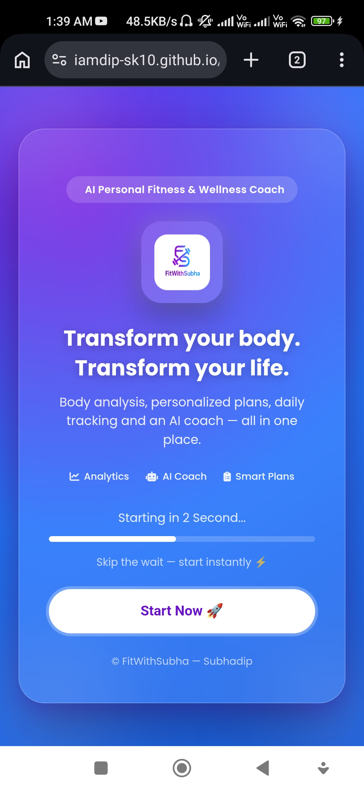
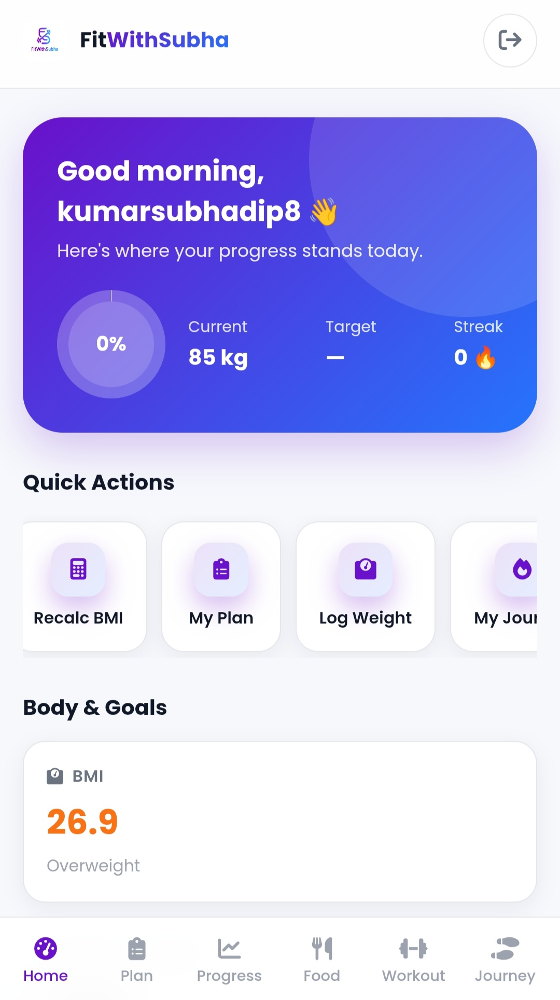
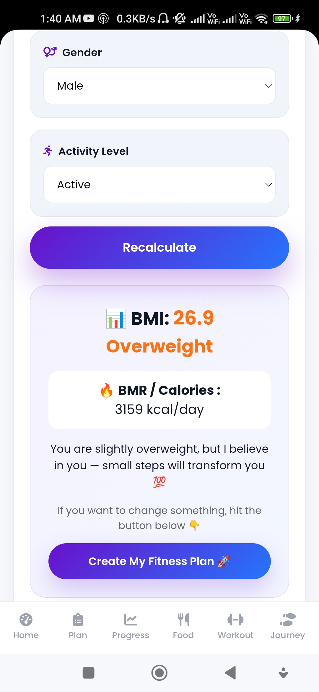
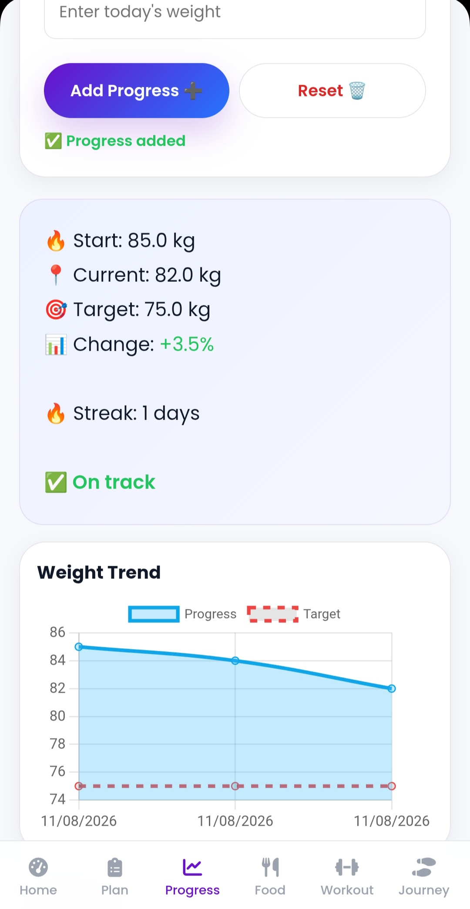
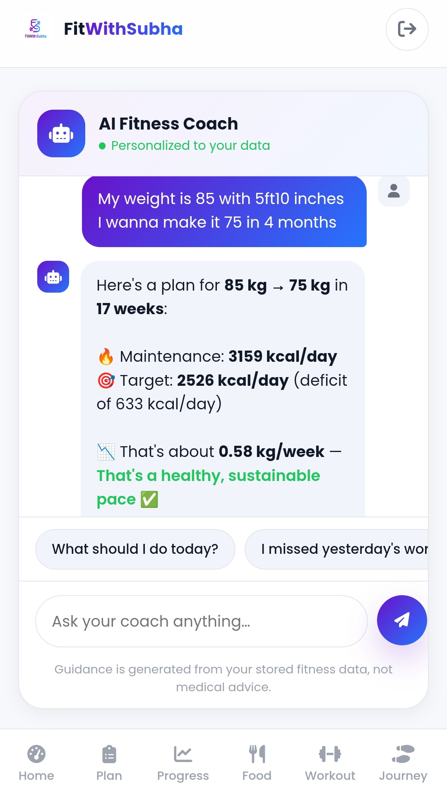
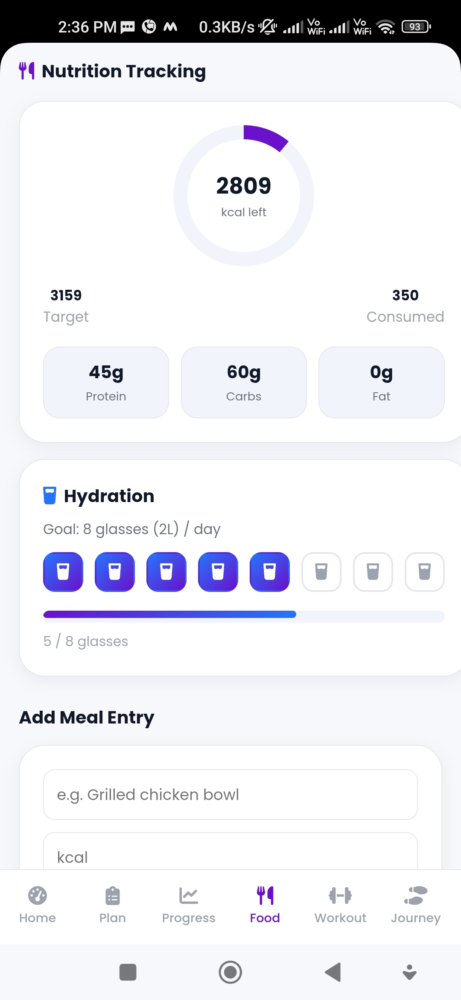
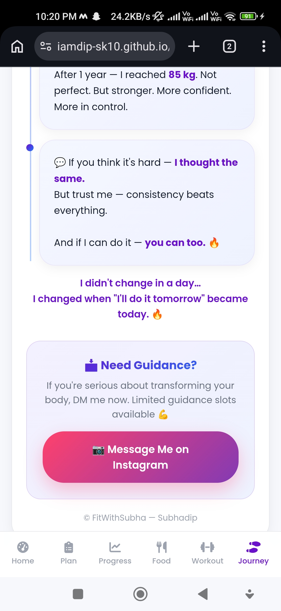

# FitWithSubha — AI Personal Fitness & Wellness Coach

**FitWithSubha** is a full-featured personal fitness and wellness web app that turns body stats, fitness goals, and daily activity into a personalized experience — combining body analysis, smart fitness planning, nutrition and workout tracking, progress analytics, and an AI coaching assistant in one platform.

**Live Demo:** https://iamdip-sk10.github.io/FitWithSubha_V2.0/  
**Repository:** https://github.com/IamDip-SK10/FitWithSubha_V2.0

---

## ✨ Features

- **Authentication** — Email/password signup and login with email verification via Firebase Auth, plus Guest Mode.
- **Smart Landing** — Onboarding and returning-user navigation.
- **Dashboard** — Personalized greeting, BMI, daily/target calories, progress ring, today's overview, and recent activity.
- **Body Stats** — BMI, BMR, and daily calorie calculator with kg/lbs and cm/ft-in conversion.
- **Fitness Plan** — Goal-based weight-loss or muscle-gain planning with calorie targets, workout split, dietary preference, and BMR/TDEE-based calculations.
- **Nutrition Tracking** — Daily calorie tracking, meal logging with protein/carb information, and an 8-glass water tracker.
- **Workouts** — Strength, Cardio, and Flexibility workout checklists with consistency and streak tracking.
- **Progress Analytics** — Weight trend, BMI trend, workout consistency, and Smart Insights.
- **AI Coach** — Rules-based personalized coaching using stored fitness information.
- **My Journey** — Founder transformation story and motivation behind FitWithSubha.
- **Profile** — Account information, fitness summary, saved goals, and preferences.

---

## 📸 Product Screenshots

### 🏠 Landing Page

### 📊 Dashboard

### 🎯 Fitness Plan

### 📈 Progress

### 🤖 AI Coach

### 🥗 Nutrition

### 🧭 My Journey

---

## 🛠 Tech Stack

- **Frontend:** HTML, CSS, JavaScript
- **Authentication:** Firebase Authentication
- **Database:** Cloud Firestore
- **Local Persistence:** localStorage
- **Charts:** Chart.js
- **Icons & Fonts:** Font Awesome, Google Fonts (Poppins)
- **Hosting:** GitHub Pages

---

## 📁 Project Structure

FitWithSubha_V2.0/
│
├── index.html
├── login.html
├── signup.html
├── dashboard.html
├── bodystat.html
├── plan.html
├── nutrition.html
├── workouts.html
├── progress.html
├── aicoach.html
├── myjourney.html
├── profile.html
│
├── bmilogo.png
├── fitness.png
│
├── assets/
│   ├── theme.css
│   └── fitcore.js
│
└── project_screenshots/
    ├── Landing.jpg
    ├── Dashboard.jpg
    ├── Plan.jpg
    ├── Progress.jpg
    ├── Aicoach.jpg
    ├── Nutrition.jpg
    └── Journey.jpg

---

## 🔄 How It Works

Sign Up / Guest Mode
        ↓
   Body Stats
        ↓
   Fitness Plan
        ↓
Dashboard ←→ Nutrition / Workouts
        ↓
     Progress
        ↓
     AI Coach
        ↓
   My Journey / Profile

Authenticated user data can be synchronized with Firebase/Firestore, while guest/on-device data uses local persistence.

---

## 🧪 Try the App

You can explore the application without creating an account by selecting **Continue as Guest** on the login page.

Suggested flow:

Body Stats → Fitness Plan → Progress → Workouts → Nutrition → AI Coach

---

## 📱 Responsive Design

FitWithSubha is designed for **desktop and mobile** with responsive layouts and navigation.

The interface uses a premium health-tech visual style featuring:

- Clean cards
- Subtle gradients
- Responsive layouts
- Progress indicators
- Loading and empty states
- Toast notifications
- Consistent navigation

---

## 🔐 Firebase

FitWithSubha uses Firebase Authentication and Cloud Firestore for account and application data, with local storage for guest/on-device persistence.

Firestore Security Rules should restrict access to authorized user data.

---

## 🚧 Roadmap

- Connected LLM-powered AI coaching
- Advanced health analytics
- More workout programs
- Personalized meal recommendations
- Wearable/device integrations
- Achievement and reward system
- Social/community features
- Advanced progress reports

---

## 👤 Author

**Subhadip Kumar**

AI • Fitness Technology • Product Development • Web Development

**Portfolio:** https://iamdip-sk10.github.io/subhadip-portfolio/

---

## 📄 License

This project is currently unlicensed / all rights reserved by the author.
